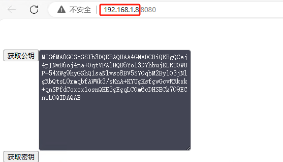
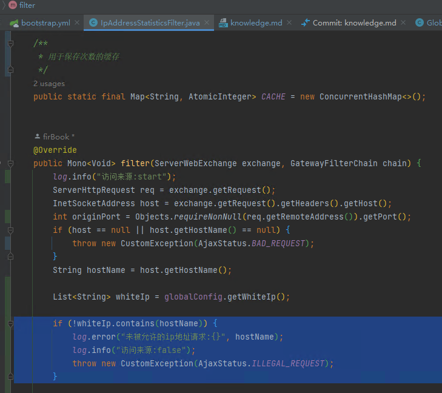

@ConfigurationProperties
    
    相信大家肯定了解@Value注解，它可以通过全限定名进行配置的绑定，这里的ConfigurationProperties其实就类似于使用多个@Value同时绑定，
    绑定的对象就是DataSource类型的对象，而且是 隐式绑定 的，意味着在配置文件编写的时候需要与对应类的字段名称 相同
https://www.cnblogs.com/tian874540961/p/12146467.html

ServerWebExchange（服务器Web交换对象）

ServerWebExchange是Spring WebFlux中的一个接口，用于封装HTTP请求和响应的上下文信息，包括请求和响应的头信息、HTTP方法、URL、请求体、响应体等。它是一个可变对象，可以通过调用mutate()方法来创建一个新的ServerWebExchange对象，并且可以在不影响原始请求和响应的情况下修改它们的属性。在GatewayFilter中，ServerWebExchange对象常常用于获取请求和响应的信息，以及进行请求和响应的转换、处理和修改。

GatewayFilterChain（网关过滤器链）

GatewayFilterChain对象是Spring Cloud Gateway中的过滤器链对象，它允许开发者在路由之前或之后自定义过滤逻辑。过滤器链由一系列GatewayFilter组成，GatewayFilter代表过滤器的实际执行单元，每个GatewayFilter都可以对请求和响应进行修改，以及在请求被路由到目标服务前后执行自定义逻辑。GatewayFilterChain则负责将请求和响应交给过滤器链中的GatewayFilter依次处理，直到请求被路由到目标服务或者响应被返回给客户端。

## 暂时
Ordered.HIGHEST_PRECEDENCE=-2147483648


## 总运作场景

token信息校验->防重放-完整性-xss攻击

# 密码学

## 盐

**盐（Salt）**

**在密码学中，是指通过在密码任意固定位置插入特定的字符串，让散列后的结果和使用原始密码的散列结果不相符，这种过程称之为“加盐”。**

["加盐"到底加的是什么 - 知乎 (zhihu.com)](https://zhuanlan.zhihu.com/p/22860282?from_voters_page=true)

文章总结，如果用户密码为123，盐为uisdkabsdma。此时应为123+uisdkabsdma经过md5加密后，存储加密后的密码（初级加盐）。将uisdkabsdma分布在123中，例如uis1d2kab3sdma，为进阶的加盐方式。

## 非对称加密

### 公钥与私钥

[(1条消息) SpringCloud Gateway API接口安全设计（加密 、签名）_gateway统一签名_响彻天堂丶的博客-CSDN博客](https://blog.csdn.net/qq_34125999/article/details/120995917#:~:text=(1) 接收方生成公钥和私钥，公钥公开，私钥保留； (2),发送方将要发送的消息采用公钥加密，得到密文，然后将密文发送给接收方； (3) 接收方收到密文后，用自己的私钥进行解密，获得明文。)

[图文彻底搞懂非对称加密（公钥密钥） - 知乎 (zhihu.com)](https://zhuanlan.zhihu.com/p/436455172)

[证书-解决非对称加密的公钥信任问题 - 知乎 (zhihu.com)](https://zhuanlan.zhihu.com/p/550974452)

[(1条消息) 使用hutool的rsa加解密工具，自定义公钥私钥字符串_hutool ras_gjxgyy的博客-CSDN博客](https://blog.csdn.net/weixin_39832308/article/details/106923108)

[(1条消息) RSA加解密工具类RSAUtils.java，使用Hutool（糊涂工具）生成_糊涂工具jar_IT阿豪的博客-CSDN博客](https://blog.csdn.net/qq_2662385590/article/details/122147386)

# 网关拦截器

## 白名单

**IpAddressStatisticsFilter**进行了白名单处理

通常情况下，是部署前端的服务器

、


需要在项目中**application.ym**l配置决定

```
  # 不需要进行过滤的白名单
  whiteIp:
    - localhost
    - 192.168.1.8

```

**IpAddressStatisticsFilter**中通过以下代码进行拦截




## 防重放

### 概念

防重放（Anti-Replay）是一种安全机制，旨在防止恶意重放攻击。恶意重放攻击是指攻击者截获合法的通信数据，并在稍后的时间内重新发送该数据，以欺骗系统或获得未授权的访问。

在防重放机制中，通常会采取以下措施：

1. 使用唯一标识符或令牌：每个合法请求都会被分配一个唯一的标识符或令牌，这个标识符在每次请求中都不同。服务器会验证请求中的标识符，如果发现已经使用过或无效的标识符，则拒绝请求。

2. 时间戳：每个请求都包含一个时间戳，服务器会检查时间戳是否在合理范围内，如果时间戳过旧或过新，则拒绝请求。

3. 单次性令牌：每个请求都使用一次性的令牌，服务器会记录已使用的令牌，如果发现重复使用同一个令牌，则拒绝请求。

4. 随机数和挑战响应：服务器可以向客户端发送一个随机数或挑战，客户端需要对其进行处理后再发送回服务器，以证明其合法性。

5. 加密和数字签名：对通信数据进行加密和数字签名，确保数据的完整性和真实性。

防重放机制可以应用在各种场景中，例如身份验证、授权、支付等涉及敏感操作的场景。通过防重放机制，可以有效地防止重放攻击，提高系统的安全性和可靠性。

### 触发情景

当黑客劫持你的请求报文后，可以利用该报文信息访问你的服务。

### 实现目的

即时截获你的请求，也不会有访问你服务的权限。

### 现有实现方式

前端与后端建议会话，有会话id。访问接口有token。均不能符合当前要求。

### 现实现
详见 com.fir.gateway.filter.request.ReplayAttackFilter


[如何有效防止API的重放攻击？ (aliyun.com)](https://help.aliyun.com/document_detail/50041.html)

[使用摘要签名认证方式调用API (aliyun.com)](https://help.aliyun.com/document_detail/29475.html?spm=a2c4g.50041.0.0.2d761eedR7VKuQ)

## xss

https://zhuanlan.zhihu.com/p/342665927
https://blog.csdn.net/fly910905/article/details/86629608

本地模仿xss攻击示例
```
http://localhost:8080/?name=<script>alert('你被攻击了!')</script>
```

## 通信
公钥
私钥
盐
session
token


## 完整性

## 响应完整性

## SQL注入

## socket加密传输

## 整体加解密 

# 问题集锦

## Error: Malformed UTF-8 data

```
core.js:523  Uncaught (in promise) Error: Malformed UTF-8 data
    at Object.stringify (core.js:523:1)
    at Object.decrypt (securityUtils.js:15:1)
    at Object.decryptAES (securityUtils.js:20:1)
    at __webpack_exports__.default (request.js:90:1)
```

查看返回日志后发现

```shell
2023-06-06 14:30:05.323  INFO 9924 --- [ctor-http-nio-2] c.f.gatteway.filter.ReplayAttackFilter   : 防重放攻击验证
2023-06-06 14:30:05.324  INFO 9924 --- [ctor-http-nio-2] c.f.gatteway.filter.ReplayAttackFilter   : 防重放攻击验证:false
{"msg":"防重放攻击失败","code":500}
5VjnRgT/t3CaHMWeq5+k2w==
wvIgNzyAe7ZGzRBPembVClFpLROrthZMz5jcd7ubNxG2jbrSY2BqEnOhc6xcGHyi
{"msg":"防重放攻击失败","code":500}
2023-06-06 14:30:05.335  INFO 9924 --- [ctor-http-nio-2] c.f.g.f.r.WrapperResponseGlobalFilter    : 响应整体解密:true
```

## String method = req.getMethodValue(); 请求类型发生变化的问题
拦截器的filter由执行顺序决定
```java
    @Override
    public int getOrder() {
        return 1;
    }
```
但目前会得到/api-one/getValue，其中/api-one为网关定义微服务前缀，并不属于其真实微服务url
目前可知,一下状态时，req.getMethodValue()得到真实的url/getValue,原因暂时未知
```java
    @Override
    public int getOrder() {
        // 设置过滤器的优先级
        return Ordered.HIGHEST_PRECEDENCE;
    }
```

## 前端传递集合形式的参数后端接受问题(完整性)

情况一：

请求方式为get

```json
// 前端发送
{"msg":["普通的客户端消息"],"as":["aaa","bbb"],"af":["aaa"],"t":["1690349913434"]}
// 后端接受
{"msg":["普通的客户端消息"],"as[]":["aaa","bbb"],"af[]":["aaa"],"t":["1690358567743"]}
```

后端接受时因为：MultiValueMap<String, String> query = request.getQueryParams();导致数组形式的参数出现上述问题。

目前考虑处理方式如下：

```java
// 前后端将请求体参数转化为json后，均去除中括号。
queryJson = queryJson.replaceAll("\\[|\\]", "");
```

情况二：

```json
// 前端发送
GET/api-one/getValue{"msg":"普通的客户端消息","as":"aaa","bbb","af":"aaa","t":1690356039849}
// 后端接受
GET/api-one/getValue{"msg":"普通的客户端消息","as":"aaa","bbb","af":"aaa","t":"1690356039849"}
```

目前考虑处理方式如下：

```json
// 前后端将json后的字符串去除"号。
queryJson = queryJson.replaceAll("\\\"", "");
```


情况三：

事情已经变得复杂起来。。。完整性校验出现新的问题

```java
// 参数
{
  "msg": {"aaa":"aa", "asda":"bb"}
}
// 前端
GET/api-one/getValue{msg:{aaa:aa,asda:bb},t:1690364037315}
// 后端
GET/api-one/getValue{msgaaa:aa,msgasda:bb,t:1690364037315}

```


目前前端处理方式(个人认为处理方式不妥)：

```js
    /**
     * 完整性签名生成
     *
     * @param method 请求类型
     * @param path 请求地址
     * @param query 请求参数
     * @returns {*} 签名密钥
     */
    calculateChecksum(method, path, query) {
        let param
        if (query === null || query === undefined) {
            param = {}
        }else {
            param = JSON.stringify(query)
            param = param.replace(/\[|\]/g, '');
            param = param.replace(/"/g, '');
        }
        // 将请求的方法、路径和查询参数拼接成一个字符串
        let data = `${method.toUpperCase()}${path}${param}`;
        return this.gBase(data);
    },
```

目前后端处理方式：

```java
        ServerHttpRequest request = exchange.getRequest();

        // 获取请求的相关信息
        HttpMethod method = request.getMethod();
        String path = request.getPath().toString();

        MultiValueMap<String, String> query = request.getQueryParams();
        String queryJson = JSONObject.toJSONString(query);
        // request.getQueryParams() 获取到的参数使得前后端完整性参数不一致，故暂时使用去除中括号[]的方式使得前后端统一
        queryJson = queryJson.replaceAll("\\[|\\]", "");
        queryJson = queryJson.replaceAll("\\\"", "");


        // 计算请求的完整性校验值
        String calculatedChecksum;
        if(method != null){
            calculatedChecksum = calculateChecksum(method, path, queryJson);
```

## 前端传递集合形式的参数后端接受问题(xss攻击)


```json
{"msg":["普通的客户端消息"],"as[]":["aaa","bbb"],"af[]":["aaa"],"t":["1690358567743"]}
```

"as[]"与"af[]"导致xss组装


```shell
java.lang.IllegalArgumentException: Invalid character '[' for QUERY_PARAM in "as[]"
	at org.springframework.web.util.HierarchicalUriComponents.verifyUriComponent(HierarchicalUriComponents.java:422)
	Suppressed: The stacktrace has been enhanced by Reactor, refer to additional information below: 
Error has been observed at the following site(s):
	*__checkpoint ⇢ org.springframework.web.cors.reactive.CorsWebFilter [DefaultWebFilterChain]
	*__checkpoint ⇢ org.springframework.cloud.gateway.filter.WeightCalculatorWebFilter [DefaultWebFilterChain]
	*__checkpoint ⇢ org.springframework.boot.actuate.metrics.web.reactive.server.MetricsWebFilter [DefaultWebFilterChain]
	*__checkpoint ⇢ HTTP GET "/api-one/getValue?msg=%E6%99%AE%E9%80%9A%E7%9A%84%E5%AE%A2%E6%88%B7%E7%AB%AF%E6%B6%88%E6%81%AF&as[]=aaa&as[]=bbb&[]af[]=aaa&t=1690360362091" [ExceptionHandlingWebHandler]
Original Stack Trace:
		at org.springframework.web.util.HierarchicalUriComponents.verifyUriComponent(HierarchicalUriComponents.java:422)
		at org.springframework.web.util.HierarchicalUriComponents.lambda$verify$4(HierarchicalUriComponents.java:388)
		at java.util.Map.forEach(Unknown Source)
		at org.springframework.web.util.HierarchicalUriComponents.verify(HierarchicalUriComponents.java:387)
		at org.springframework.web.util.HierarchicalUriComponents.<init>(HierarchicalUriComponents.java:146)
		at org.springframework.web.util.UriComponentsBuilder.buildInternal(UriComponentsBuilder.java:483)
		at org.springframework.web.util.UriComponentsBuilder.build(UriComponentsBuilder.java:472)
		at com.fir.gateway.filter.request.XssFormFilter.change(XssFormFilter.java:80)
		at com.fir.gateway.filter.request.XssFormFilter.filter(XssFormFilter.java:46)
		at org.springframework.cloud.gateway.handler.FilteringWebHandler$GatewayFilterAdapter.filter(FilteringWebHandler.java:137)
		at org.springframework.cloud.gateway.filter.OrderedGatewayFilter.filter(OrderedGatewayFilter.java:44)
		at org.springframework.cloud.gateway.handler.FilteringWebHandler$DefaultGatewayFilterChain.lambda$filter$0(FilteringWebHandler.java:117)
		at reactor.core.publisher.MonoDefer.subscribe(MonoDefer.java:44)
		at reactor.core.publisher.MonoDefer.subscribe(MonoDefer.java:52)
		at reactor.core.publisher.MonoDefer.subscribe(MonoDefer.java:52)
		at reactor.core.publisher.MonoDefer.subscribe(MonoDefer.java:52)
		at reactor.core.publisher.MonoDefer.subscribe(MonoDefer.java:52)
		at reactor.core.publisher.MonoDefer.subscribe(MonoDefer.java:52)
		at reactor.core.publisher.InternalMonoOperator.subscribe(InternalMonoOperator.java:64)
		at reactor.core.publisher.MonoDefer.subscribe(MonoDefer.java:52)
		at reactor.core.publisher.Mono.subscribe(Mono.java:4455)
		at reactor.core.publisher.MonoIgnoreThen$ThenIgnoreMain.subscribeNext(MonoIgnoreThen.java:263)
		at reactor.core.publisher.MonoIgnoreThen.subscribe(MonoIgnoreThen.java:51)
		at reactor.core.publisher.MonoFlatMap$FlatMapMain.onNext(MonoFlatMap.java:157)
		at reactor.core.publisher.FluxSwitchIfEmpty$SwitchIfEmptySubscriber.onNext(FluxSwitchIfEmpty.java:74)
		at reactor.core.publisher.MonoNext$NextSubscriber.onNext(MonoNext.java:82)
		at reactor.core.publisher.FluxConcatMap$ConcatMapImmediate.innerNext(FluxConcatMap.java:282)
		at reactor.core.publisher.FluxConcatMap$ConcatMapInner.onNext(FluxConcatMap.java:863)
		at reactor.core.publisher.FluxMap$MapSubscriber.onNext(FluxMap.java:122)
		at reactor.core.publisher.FluxSwitchIfEmpty$SwitchIfEmptySubscriber.onNext(FluxSwitchIfEmpty.java:74)
		at reactor.core.publisher.Operators$MonoSubscriber.complete(Operators.java:1816)
		at reactor.core.publisher.MonoFlatMap$FlatMapMain.onNext(MonoFlatMap.java:151)
		at reactor.core.publisher.FluxMap$MapSubscriber.onNext(FluxMap.java:122)
		at reactor.core.publisher.MonoNext$NextSubscriber.onNext(MonoNext.java:82)
		at reactor.core.publisher.FluxConcatMap$ConcatMapImmediate.innerNext(FluxConcatMap.java:282)
		at reactor.core.publisher.FluxConcatMap$ConcatMapInner.onNext(FluxConcatMap.java:863)
		at reactor.core.publisher.FluxOnErrorResume$ResumeSubscriber.onNext(FluxOnErrorResume.java:79)
		at reactor.core.publisher.MonoPeekTerminal$MonoTerminalPeekSubscriber.onNext(MonoPeekTerminal.java:180)
		at reactor.core.publisher.Operators$MonoSubscriber.complete(Operators.java:1816)
		at reactor.core.publisher.MonoFilterWhen$MonoFilterWhenMain.onNext(MonoFilterWhen.java:149)
		at reactor.core.publisher.Operators$ScalarSubscription.request(Operators.java:2398)
		at reactor.core.publisher.MonoFilterWhen$MonoFilterWhenMain.onSubscribe(MonoFilterWhen.java:112)
		at reactor.core.publisher.MonoJust.subscribe(MonoJust.java:55)
		at reactor.core.publisher.Mono.subscribe(Mono.java:4455)
		at reactor.core.publisher.FluxConcatMap$ConcatMapImmediate.drain(FluxConcatMap.java:451)
		at reactor.core.publisher.FluxConcatMap$ConcatMapImmediate.onNext(FluxConcatMap.java:251)
		at reactor.core.publisher.FluxDematerialize$DematerializeSubscriber.onNext(FluxDematerialize.java:98)
		at reactor.core.publisher.FluxDematerialize$DematerializeSubscriber.onNext(FluxDematerialize.java:44)
		at reactor.core.publisher.FluxIterable$IterableSubscription.slowPath(FluxIterable.java:272)
		at reactor.core.publisher.FluxIterable$IterableSubscription.request(FluxIterable.java:230)
		at reactor.core.publisher.FluxDematerialize$DematerializeSubscriber.request(FluxDematerialize.java:127)
		at reactor.core.publisher.FluxConcatMap$ConcatMapImmediate.onSubscribe(FluxConcatMap.java:236)
		at reactor.core.publisher.FluxDematerialize$DematerializeSubscriber.onSubscribe(FluxDematerialize.java:77)
		at reactor.core.publisher.FluxIterable.subscribe(FluxIterable.java:165)
		at reactor.core.publisher.FluxIterable.subscribe(FluxIterable.java:87)
		at reactor.core.publisher.InternalFluxOperator.subscribe(InternalFluxOperator.java:62)
		at reactor.core.publisher.FluxDefer.subscribe(FluxDefer.java:54)
		at reactor.core.publisher.Mono.subscribe(Mono.java:4455)
		at reactor.core.publisher.FluxConcatMap$ConcatMapImmediate.drain(FluxConcatMap.java:451)
		at reactor.core.publisher.FluxConcatMap$ConcatMapImmediate.onSubscribe(FluxConcatMap.java:219)
		at reactor.core.publisher.FluxIterable.subscribe(FluxIterable.java:165)
		at reactor.core.publisher.FluxIterable.subscribe(FluxIterable.java:87)
		at reactor.core.publisher.InternalMonoOperator.subscribe(InternalMonoOperator.java:64)
		at reactor.core.publisher.MonoDefer.subscribe(MonoDefer.java:52)
		at reactor.core.publisher.InternalMonoOperator.subscribe(InternalMonoOperator.java:64)
		at reactor.core.publisher.MonoDefer.subscribe(MonoDefer.java:52)
		at reactor.core.publisher.InternalMonoOperator.subscribe(InternalMonoOperator.java:64)
		at reactor.core.publisher.MonoDefer.subscribe(MonoDefer.java:52)
		at reactor.core.publisher.InternalMonoOperator.subscribe(InternalMonoOperator.java:64)
		at reactor.core.publisher.MonoDefer.subscribe(MonoDefer.java:52)
		at reactor.core.publisher.InternalMonoOperator.subscribe(InternalMonoOperator.java:64)
		at reactor.core.publisher.MonoDefer.subscribe(MonoDefer.java:52)
		at reactor.core.publisher.Mono.subscribe(Mono.java:4455)
		at reactor.core.publisher.MonoIgnoreThen$ThenIgnoreMain.subscribeNext(MonoIgnoreThen.java:263)
		at reactor.core.publisher.MonoIgnoreThen.subscribe(MonoIgnoreThen.java:51)
		at reactor.core.publisher.InternalMonoOperator.subscribe(InternalMonoOperator.java:64)
		at reactor.core.publisher.MonoDeferContextual.subscribe(MonoDeferContextual.java:55)
		at reactor.netty.http.server.HttpServer$HttpServerHandle.onStateChange(HttpServer.java:993)
		at reactor.netty.ReactorNetty$CompositeConnectionObserver.onStateChange(ReactorNetty.java:677)
		at reactor.netty.transport.ServerTransport$ChildObserver.onStateChange(ServerTransport.java:477)
		at reactor.netty.http.server.HttpServerOperations.onInboundNext(HttpServerOperations.java:573)
		at reactor.netty.channel.ChannelOperationsHandler.channelRead(ChannelOperationsHandler.java:113)
		at io.netty.channel.AbstractChannelHandlerContext.invokeChannelRead(AbstractChannelHandlerContext.java:444)
		at io.netty.channel.AbstractChannelHandlerContext.invokeChannelRead(AbstractChannelHandlerContext.java:420)
		at io.netty.channel.AbstractChannelHandlerContext.fireChannelRead(AbstractChannelHandlerContext.java:412)
		at reactor.netty.http.server.HttpTrafficHandler.channelRead(HttpTrafficHandler.java:220)
		at io.netty.channel.AbstractChannelHandlerContext.invokeChannelRead(AbstractChannelHandlerContext.java:442)
		at io.netty.channel.AbstractChannelHandlerContext.invokeChannelRead(AbstractChannelHandlerContext.java:420)
		at io.netty.channel.AbstractChannelHandlerContext.fireChannelRead(AbstractChannelHandlerContext.java:412)
		at io.netty.channel.CombinedChannelDuplexHandler$DelegatingChannelHandlerContext.fireChannelRead(CombinedChannelDuplexHandler.java:436)
		at io.netty.handler.codec.ByteToMessageDecoder.fireChannelRead(ByteToMessageDecoder.java:336)
		at io.netty.handler.codec.ByteToMessageDecoder.channelRead(ByteToMessageDecoder.java:308)
		at io.netty.channel.CombinedChannelDuplexHandler.channelRead(CombinedChannelDuplexHandler.java:251)
		at io.netty.channel.AbstractChannelHandlerContext.invokeChannelRead(AbstractChannelHandlerContext.java:442)
		at io.netty.channel.AbstractChannelHandlerContext.invokeChannelRead(AbstractChannelHandlerContext.java:420)
		at io.netty.channel.AbstractChannelHandlerContext.fireChannelRead(AbstractChannelHandlerContext.java:412)
		at io.netty.channel.DefaultChannelPipeline$HeadContext.channelRead(DefaultChannelPipeline.java:1410)
		at io.netty.channel.AbstractChannelHandlerContext.invokeChannelRead(AbstractChannelHandlerContext.java:440)
		at io.netty.channel.AbstractChannelHandlerContext.invokeChannelRead(AbstractChannelHandlerContext.java:420)
		at io.netty.channel.DefaultChannelPipeline.fireChannelRead(DefaultChannelPipeline.java:919)
		at io.netty.channel.nio.AbstractNioByteChannel$NioByteUnsafe.read(AbstractNioByteChannel.java:166)
		at io.netty.channel.nio.NioEventLoop.processSelectedKey(NioEventLoop.java:788)
		at io.netty.channel.nio.NioEventLoop.processSelectedKeysOptimized(NioEventLoop.java:724)
		at io.netty.channel.nio.NioEventLoop.processSelectedKeys(NioEventLoop.java:650)
		at io.netty.channel.nio.NioEventLoop.run(NioEventLoop.java:562)
		at io.netty.util.concurrent.SingleThreadEventExecutor$4.run(SingleThreadEventExecutor.java:997)
		at io.netty.util.internal.ThreadExecutorMap$2.run(ThreadExecutorMap.java:74)
		at io.netty.util.concurrent.FastThreadLocalRunnable.run(FastThreadLocalRunnable.java:30)
		at java.lang.Thread.run(Unknown Source)
```


